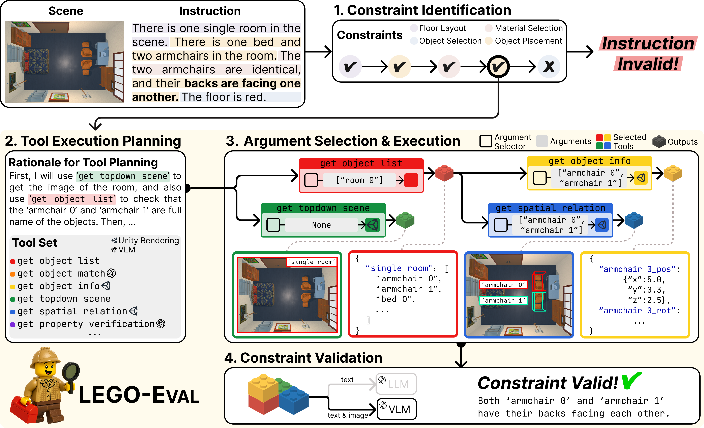

<h1 align="center">
LEGO-Eval: Towards Fine-Grained Evaluation on Synthesizing 3D Embodied Environments with Tool Augmentation
</h1> 
<h4 align="center">
  <a href="https://gyeomh.github.io">Gyeom Hwangbo*</a>,
  <a href="https://hyungjoo-homepage.netlify.app">Hyungjoo Chae*</a>,
  Minseok Kang,
  Hyeonjong Ju,
  Soohyun Oh,
  <a href="https://jinyeo.weebly.com">Jinyoung Yeo</a>
</h4>

<p align="center">
  <a href="https://arxiv.org/abs/2511.03001">
    
  </a>
  <a href="https://huggingface.co/LEGO-Eval">
    
  </a>
</p>

LEGO-Eval is a **tool-augmented evaluation framework** for text-guided 3D scene synthesis. It enables fine-grained and interpretable assessment of instruction-scene alignment by grounding scene components using a diverse suite of 21 multimodal tools, supporting multi-hop reasoning over spatial and attribute constraints.



## Overview
Recently, there has been notable progress in text-guided 3D scene synthesis using large language models (LLMs). However, evaluating the alignment between textual instructions and the resulting 3D scenes remains a challenging problem, as existing approaches often lack a deep understanding of 3D spatial structures, limiting their reliability. To address this limitation, we introduce:

- **LEGO-Eval**: An evaluation framework that uses diverse tools to explicitly ground scene elements and assess instruction-scene alignment.
- **LEGO-Bench**: A benchmark for text-guided 3D scene synthesis, featuring fine-grained instructions that describe complex spatial layouts and object attributes in real-world scenes.

----

## 1. Environment Setup

### 1-1. Build Docker File
```bash
cd LEGO-EVAL/setup/docker
docker build -t [your_image_name]:[tag] .
```

### 1-2. Run Docker
```bash
docker run -it --privileged \
  --device /dev/tty0:/dev/tty0 \
  -v /path/to/local/huggingface_cache/:/mount/huggingface_cache/ \ # Path to your local model storage
  -v /path/to/local/workspace:/mount/workspace \ # Path to your local workspace
  -v /tmp/.X11-unix:/tmp/.X11-unix \
  -v /dev/shm:/dev/shm \
  --gpus all \
  --name container_name \
  [your_image_name]:[tag] bash

# To run the container as a specific host user, add the following options:
#  -u <USER_ID>:<GROUP_ID>        # Host user ID and group ID
#  -v /etc/passwd:/etc/passwd:ro
#  -v /etc/group:/etc/group:ro
#
# Note:
# Starting an X screen requires running the container as root.
# All other processes can be executed under a non-root user.
```

### 1-3. Start Xorg
```bash
# Inside the Docker container
cd /mount/workspace/LEGO-EVAL/setup
tmux new -s xorg_start
python startx.py <SCREEN_NUMBER>  # X screen number (GPU ID (e.g., 0))

# Detach the tmux session: Ctrl+b, then d
# Verify that the X screen is running correctly:
#   python check_x.py
# Note: Make sure to update the x_org argument in the script if needed.
```

### 1-4. Installations
```bash
conda create -n envgen_eval python=3.10
conda init bash
source ~/.bashrc
```
```bash
conda activate envgen_eval
pip install -r requirements.txt
pip install --upgrade "pydantic>=2.0"
pip install --extra-index-url https://ai2thor-pypi.allenai.org ai2thor==0+8524eadda94df0ab2dbb2ef5a577e4d37c712897
```

## 2. Dataset and 3D Assets Setup

### 2-1. Download LEGO-Bench Dataset
LEGO-Bench is hosted on [Hugging Face Datasets](https://huggingface.co/datasets/LEGO-Eval/LEGO_Bench).

### 2-2. Download 3D Assets

LEGO-Eval uses 3D assets from [Objathor](https://github.com/allenai/objathor),
specifically the assets used in [Holodeck](https://github.com/allenai/Holodeck).

Please download the assets by running the following commands:

```bash
python -m objathor.dataset.download_holodeck_base_data --version 2023_09_23
python -m objathor.dataset.download_assets --version 2023_09_23
python -m objathor.dataset.download_annotations --version 2023_09_23
python -m objathor.dataset.download_features --version 2023_09_23

# By default, assets are saved to ~/.objathor-assets/.
# You can change the download directory by specifying the --path argument.
# On Linux, you may encounter a "directory not empty" error;
# this is a known issue in the original Objathor download script and can be safely ignored.
```

### 2-3. Download 2D Images of the Assets

LEGO-Eval utilizes pre-captured asset images from multiple viewpoints to enable efficient evaluation.

Please download the pre-captured asset images hosted on  
[Hugging Face Datasets](https://huggingface.co/datasets/LEGO-Eval/object_images).


## 3. Scene Preprocess

### 3-1. Scene Json File Format
Ensure that all scene JSON files follow the [specified format](etc/FORMAT.md).

### 3-2. Preprocess
During preprocessing, images of scenes are captured in advance, enabling efficient evaluation.

Before preprocessing, make sure your scene Json files are in one folder as below:
```
.
└── scenes
    ├── scene1.json
    ├── scene2.json
    ├── scene3.json
    ├── scene4.json
    └── ...
```

Then, run below:
```bash
bash preprocess/parallel_preprocess.sh
```

## Quick Start
```
cd LEGO-Eval
bash scripts/run.sh

# To evaluate instructions beyond those provided in LEGO-Bench, the shell script can be adjusted accordingly.
```

## Citation
```bibtex
@article{hwangbo2025lego,
  title={LEGO-Eval: Towards Fine-Grained Evaluation on Synthesizing 3D Embodied Environments with Tool Augmentation},
  author={Hwangbo, Gyeom and Chae, Hyungjoo and Kang, Minseok and Ju, Hyeonjong and Oh, Soohyun and Yeo, Jinyoung},
  journal={arXiv preprint arXiv:2511.03001},
  year={2025}
}
```
